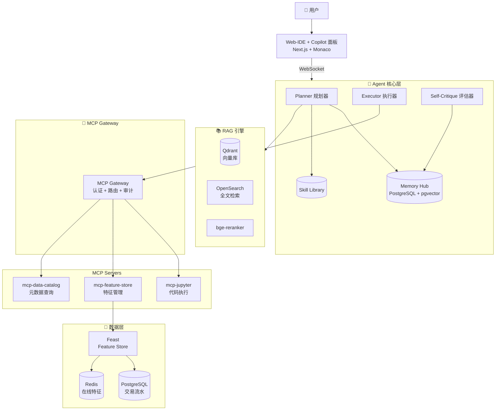

# Agentic MLOps Platform — MVP 需求规格说明书

> Code-First 智能体驱动机器学习建模平台 · MVP（Phase 1）

| 项 | 内容 |
|---|---|
| 文档版本 | v0.1 |
| 状态 | Draft（待团队评审） |
| 验证目标 | 全栈架构完整性 · 端到端可演示 |
| 锚定场景 | 金融信用卡反欺诈 |
| 预计周期 | 8 ~ 10 周 |

---

## 1. 项目背景

### 1.1 一句话定位
打造下一代 **Agentic MLOps** 建模平台 —— 让数据科学家用自然语言驱动 AI Agent，自主完成从数据探查、特征工程到模型训练的全流程，所有底层工具通过 **MCP 标准协议** 统一调用，**RAG** 持续注入行业知识，**Hermes Skill Library** 沉淀组织经验。

### 1.2 MVP 核心命题
**「能否用一个 Agent + 一套 MCP + 一个知识库，在金融反欺诈数据上跑通端到端建模闭环？」**

如果 MVP 能演示：用户在 Web-IDE 输入 *"为这张信用卡交易表构建反欺诈模型"* → Agent 自主完成数据探查、合规检查、特征工程、模型训练 → 返回 AUC ≥ 0.90 的基线模型，则架构假设被验证。

### 1.3 非目标（明确排除，留给 Phase 2 / Phase 3）

| 推迟项 | 原因 |
|---|---|
| Ray / K8s 分布式训练 | MVP 用本地多进程足以支撑百万行数据 |
| 强隔离沙箱（gVisor/Firecracker） | MVP 用 Docker 容器隔离即可 |
| 细粒度 ACL + 企业级审计 | MVP 用基础 RBAC + 结构化日志 |
| 工业故障预测场景 | 一次只打透一个场景 |
| Low-Code DAG 编辑器 | MVP 仅 Code-First |
| 生产级模型服务（Triton/KServe） | MVP 仅本地推理验证 |
| 私有化模型推理（vLLM） | MVP 直接调用 Anthropic API |
| 信创栈 / 国密适配 | 私有化交付阶段再考虑 |

---

## 2. 系统总览

### 2.1 MVP 架构图



### 2.2 端到端 Demo 流程（黄金路径）

| 步骤 | 触发者 | 动作 | 涉及模块 |
|---|---|---|---|
| 1 | 用户 | Web-IDE 输入："为信用卡交易表构建反欺诈模型" | UI |
| 2 | Agent | 解析意图，检索 Memory Hub 与 Skill Library | Agent + Memory |
| 3 | Agent | RAG 召回：反欺诈合规规则 + 历史特征模板 | RAG |
| 4 | Agent | 生成 6 步执行计划，UI 展示等待确认 | Agent + UI |
| 5 | 用户 | 点击"确认执行" | UI |
| 6 | Agent | 调用 `mcp-data-catalog` 获取表 Schema | MCP + Catalog |
| 7 | Agent | 调用 `mcp-jupyter` 执行数据探查代码 | MCP + Jupyter |
| 8 | Agent | 生成 Feast 特征定义，调用 `mcp-feature-store` 注册 | MCP + Feast |
| 9 | Agent | 在 Jupyter 中训练 LightGBM 模型 | MCP + Jupyter |
| 10 | Agent | Self-Critique 评估 AUC，若 < 0.85 则迭代 | Agent |
| 11 | Agent | 抽象本次流程为新 Skill 写回 Skill Library | Memory |
| 12 | UI | 展示最终模型指标 + 特征重要性 + 思考链回放 | UI |

---

## 3. 模块功能需求

### 3.1 Module 1：Agent 核心 + Hermes Skill 库

#### 3.1.1 功能列表

| ID | 功能 | 优先级 | 验收点 |
|---|---|---|---|
| A-01 | 自然语言意图理解 | P0 | 能将用户输入解析为结构化 Task |
| A-02 | 多步任务规划（Planner） | P0 | 输出 JSON 格式的 Step List |
| A-03 | 双循环执行（Outer + Inner Loop） | P0 | 每个 Step 可独立执行并产生 Observation |
| A-04 | 工具调用（通过 MCP） | P0 | 调用 MCP Gateway 而非直连工具 |
| A-05 | 短期记忆（会话内） | P0 | Redis 持久化当前会话状态 |
| A-06 | 长期记忆（向量检索） | P0 | pgvector 检索历史相似项目 |
| A-07 | Skill Library 检索 | P0 | 按意图 Embedding 召回 Top-K Skills |
| A-08 | Self-Critique 评估 | P1 | 独立 LLM 评估当前路径偏离度 |
| A-09 | Skill 自动抽象（Learning Loop） | P1 | 高分实验自动生成新 Skill 入库 |
| A-10 | 思考链可视化输出 | P0 | 流式 SSE 推送 Plan / ToolCall / Observation |

#### 3.1.2 关键数据结构

```python
# Skill Schema（最简版）
class Skill:
    skill_id: str               # uuid
    name: str                   # e.g. "generate_rolling_window_features"
    description: str            # 自然语言描述
    trigger_conditions: dict    # 触发条件（数据特征、意图关键词）
    input_schema: dict          # JSON Schema
    output_schema: dict
    code_template: str          # Jinja2 模板
    embedding: list[float]      # 语义检索向量
    confidence: float           # 0~1
    invocation_count: int
    success_rate: float
    created_by: str             # "system" | "user" | "auto-distilled"
    created_at: datetime
```

```python
# Plan Step Schema
class PlanStep:
    step_id: int
    intent: str                 # "数据探查" / "特征生成" / "模型训练"
    tool: str                   # MCP tool name
    params: dict
    expected_output: str
    requires_confirmation: bool # HITL 关键步骤标记
```

#### 3.1.3 接口（HTTP + WebSocket）

```
POST /api/v1/agent/sessions              # 创建会话
POST /api/v1/agent/sessions/{id}/messages  # 发送用户消息
WS   /api/v1/agent/sessions/{id}/stream    # 订阅 Agent 流式输出
POST /api/v1/agent/sessions/{id}/confirm   # HITL 确认
GET  /api/v1/skills                        # 列出技能
POST /api/v1/skills                        # 手动注册技能
```

---

### 3.2 Module 2：MCP Gateway + MCP Servers

#### 3.2.1 MCP Gateway 功能

| ID | 功能 | 优先级 | 验收点 |
|---|---|---|---|
| G-01 | 工具能力发现（Capability Manifest） | P0 | Agent 启动即可获取全量工具列表 |
| G-02 | 统一认证（JWT） | P0 | 拒绝无效 Token |
| G-03 | 基础 RBAC（admin / scientist 两角色） | P0 | 实习生角色无法调用 Delete 工具 |
| G-04 | 调用路由 | P0 | 按 tool name 路由到对应 MCP Server |
| G-05 | 结构化审计日志 | P0 | 每次调用落 JSON 日志，含 audit_id |
| G-06 | 调用熔断 | P1 | 单 Session 1 分钟 > 10 次失败强制降级只读 |
| G-07 | `dry_run` 支持 | P1 | 写操作支持模拟执行 |
| G-08 | PII 脱敏 | P0 | 工具返回结果中身份证号/卡号自动掩码 |

#### 3.2.2 MVP 必备 MCP Servers（共 3 个）

##### `mcp-jupyter`
- `execute_code(code: str, kernel_id: str) -> ExecuteResult`
- `create_kernel(image: str) -> KernelInfo`
- `list_variables(kernel_id: str) -> list[Variable]`
- `restart_kernel(kernel_id: str) -> bool`

##### `mcp-feature-store`
- `list_feature_views() -> list[FeatureView]`
- `register_feature_view(definition: dict, dry_run: bool) -> RegisterResult`
- `materialize(view_name: str, start: datetime, end: datetime) -> Job`
- `get_online_features(view_name: str, entity_keys: list) -> dict`
- `compute_feature_stats(view_name: str) -> Stats`  # IV/PSI

##### `mcp-data-catalog`
- `list_tables(database: str) -> list[Table]`
- `get_schema(table: str) -> Schema`
- `sample_rows(table: str, n: int) -> list[dict]`
- `profile_column(table: str, column: str) -> ColumnProfile`  # 分布、缺失率、唯一值数

#### 3.2.3 MCP 协议合规要求
- 严格遵循 Anthropic MCP Spec（2025 年版本）
- 每个 MCP Server 必须实现 `list_tools` 与 `call_tool`
- 错误必须按 MCP 规范返回，不裸抛异常

---

### 3.3 Module 3：RAG 知识库引擎

#### 3.3.1 功能列表

| ID | 功能 | 优先级 | 验收点 |
|---|---|---|---|
| R-01 | 文档接入（PDF / Markdown / 内部 Wiki） | P0 | 支持目录批量入库 |
| R-02 | Chunk 切分（章节 + 滑窗） | P0 | 平均块长 500 ~ 800 字符 |
| R-03 | Embedding 生成（bge-small-zh） | P0 | 入库吞吐 ≥ 100 chunks/秒 |
| R-04 | 向量检索（Qdrant） | P0 | Top-10 召回延迟 < 100ms |
| R-05 | 混合检索（向量 + BM25） | P1 | 命中率较纯向量 +15% |
| R-06 | Re-ranking（bge-reranker） | P1 | NDCG@5 较初排 +10% |
| R-07 | 元数据过滤（按域：合规 / 实验 / 协议） | P0 | 支持 `where domain='compliance'` |
| R-08 | 增量更新 | P1 | 修改文档无需全量重建 |
| R-09 | Context 注入 Agent | P0 | Agent System Prompt 自动拼接 Top-K |

#### 3.3.2 MVP 预置知识库（金融场景）

| 域 | 内容来源 | 数量级 |
|---|---|---|
| 反欺诈合规 | 央行《支付清算管理办法》节选 + PCI DSS 摘要 | ~50 文档 |
| 反洗钱规则 | 通用 AML 规则模板（开源整理） | ~30 规则 |
| 特征模板 | Kaggle 反欺诈 Top 方案的特征工程经验 | ~100 条 |
| 历史实验 | MVP 期内的所有实验记录 | 动态增长 |

#### 3.3.3 接口

```
POST /api/v1/rag/documents              # 文档入库
DELETE /api/v1/rag/documents/{id}
POST /api/v1/rag/search                 # 检索（带过滤）
GET  /api/v1/rag/stats                  # 库统计
```

---

### 3.4 Module 4：Web-IDE / Copilot 交互面板

#### 3.4.1 功能列表

| ID | 功能 | 优先级 | 验收点 |
|---|---|---|---|
| U-01 | 项目管理（创建/切换） | P0 | 支持多项目隔离 |
| U-02 | 代码编辑器（Monaco） | P0 | Python 语法高亮、自动补全 |
| U-03 | Notebook 视图 | P0 | 支持 .ipynb 编辑与执行 |
| U-04 | Agent Chat 面板（右侧栏） | P0 | 流式输出、Markdown 渲染 |
| U-05 | 思考链可视化 | P0 | Plan / ToolCall / Observation 分块展示 |
| U-06 | HITL 确认弹窗 | P0 | 关键操作（写特征、删除）需点击确认 |
| U-07 | 实验对比看板 | P1 | 多实验指标并排展示 |
| U-08 | 特征列表 / 模型列表侧边栏 | P1 | 从 Feast / MLflow 拉取展示 |
| U-09 | 文件浏览器 | P0 | 浏览项目内文件 |
| U-10 | 暗色 / 亮色主题切换 | P2 | 视觉舒适 |

#### 3.4.2 关键交互细节
- **双视图模式**：左侧代码 / Notebook，右侧 Agent Chat，比例可调
- **代码插入**：Agent 生成代码后，用户可点击"插入到 Notebook"按钮一键插入
- **思考链折叠**：默认折叠 Observation 长输出，点击展开
- **快捷键**：`Cmd+K` 唤起 Agent，`Cmd+Enter` 执行当前 Cell

---

### 3.5 Module 5：Feature Store 集成

#### 3.5.1 功能列表

| ID | 功能 | 优先级 | 验收点 |
|---|---|---|---|
| F-01 | Feast 部署与初始化 | P0 | Docker Compose 一键拉起 |
| F-02 | 离线存储（PostgreSQL） | P0 | 支持时间窗口查询 |
| F-03 | 在线存储（Redis） | P0 | 单条查询 < 10ms |
| F-04 | 特征视图注册（通过 MCP） | P0 | Agent 可生成 Python 定义并注册 |
| F-05 | 特征物化（materialize） | P0 | 离线 → 在线同步 |
| F-06 | 实时特征写入（流式） | P1 | Kafka → Feast 流式管道 |
| F-07 | 特征质量监控（IV / PSI） | P1 | 自动计算并存储 |
| F-08 | 特征血缘（来源表、依赖） | P1 | 与 DataHub 集成（MVP 可简化） |

#### 3.5.2 MVP 数据集
**使用 Kaggle 公开数据集**：[Credit Card Fraud Detection](https://www.kaggle.com/datasets/mlg-ulb/creditcardfraud)
- 284,807 笔交易，492 笔欺诈（0.172%）
- 已脱敏（V1~V28 为 PCA 主成分）
- 用于 MVP 演示无合规风险

#### 3.5.3 示例特征视图（Agent 应能自主生成）

```python
from feast import FeatureView, Entity, Field
from feast.types import Float32, Int64
from datetime import timedelta

card = Entity(name="card_id", join_keys=["card_id"])

txn_rolling_features = FeatureView(
    name="txn_rolling_features",
    entities=[card],
    ttl=timedelta(days=30),
    schema=[
        Field(name="txn_count_1h", dtype=Int64),
        Field(name="txn_amount_sum_1h", dtype=Float32),
        Field(name="txn_amount_max_24h", dtype=Float32),
        Field(name="merchant_diversity_24h", dtype=Int64),
    ],
    source=transaction_source,
)
```

---

## 4. 非功能性需求

| 维度 | 要求 |
|---|---|
| **响应时延** | Agent 首 Token < 2s；MCP 工具调用 P95 < 500ms |
| **并发** | MVP 支持 10 个并发会话 |
| **数据量** | 单表支持 500 万行交易数据 |
| **可观测性** | 所有 LLM 调用、Token 消耗、MCP 调用全链路可追踪（OpenTelemetry + Langfuse） |
| **可移植性** | Docker Compose 一键启动全栈本地环境 |
| **代码质量** | 核心模块测试覆盖率 ≥ 70%；遵循 Black + Ruff + mypy |
| **文档** | 每个模块独立 README + ADR（架构决策记录） |

---

## 5. 技术选型（MVP 精简版）

| 层 | 组件 | 版本 / 选择 | 选型理由 |
|---|---|---|---|
| **LLM 推理** | Anthropic Claude API | claude-sonnet-4 | MVP 阶段无私有化需求，直接用云端 API 最快 |
| **Agent 框架** | LangGraph + 自研 Hermes 风格 Loop | LangGraph 0.2+ | 成熟、可控、与 Anthropic 生态兼容 |
| **MCP SDK** | Anthropic MCP Python SDK | 最新版 | 官方标准实现 |
| **后端** | FastAPI + Uvicorn | FastAPI 0.110+ | 异步性能好、Pydantic 类型严格 |
| **任务队列** | Celery + Redis | — | 解耦长任务（如 materialize） |
| **向量库** | Qdrant | 1.10+ | Rust 性能强、过滤优秀 |
| **全文检索** | OpenSearch | 2.x | 中文分词成熟 |
| **Embedding** | bge-small-zh-v1.5 | — | 中文最优开源轻量模型 |
| **关系库** | PostgreSQL + pgvector | PG 16 | 一库多用，省运维成本 |
| **缓存 / KV** | Redis | 7.x | 通用 |
| **Feature Store** | Feast | 0.40+ | 开源主流 |
| **训练框架** | LightGBM + scikit-learn | — | MVP 用基线模型即可 |
| **实验追踪** | MLflow | 2.14+ | 开源主流，与 Feast 互补 |
| **前端** | Next.js 14 + TypeScript | — | 现代化、SSR 友好 |
| **编辑器** | Monaco Editor | — | VS Code 同款 |
| **UI 库** | shadcn/ui + Tailwind CSS | — | 优雅、可定制 |
| **链路追踪** | OpenTelemetry + Langfuse | — | LLM 调用全链路可观测 |
| **容器化** | Docker + Docker Compose | — | MVP 不上 K8s |

---

## 6. 仓库目录结构

```
agentic-mlops-platform/
├── README.md                      # 项目介绍 + 快速开始
├── docs/
│   ├── MVP_SPEC.md               # 本文档
│   ├── ARCHITECTURE.md           # 架构详述
│   ├── adr/                      # 架构决策记录
│   │   ├── 0001-choose-langgraph.md
│   │   └── 0002-mcp-as-protocol.md
│   └── images/
├── apps/
│   ├── web/                      # Next.js 前端
│   │   ├── app/
│   │   ├── components/
│   │   │   ├── agent-chat/       # Agent 对话面板
│   │   │   ├── code-editor/      # Monaco 集成
│   │   │   └── thinking-chain/   # 思考链可视化
│   │   └── lib/
│   └── api/                      # FastAPI 后端
│       ├── main.py
│       ├── routers/
│       │   ├── agent.py
│       │   ├── rag.py
│       │   └── skills.py
│       └── services/
├── packages/
│   ├── agent-core/               # Agent 核心
│   │   ├── hermes/
│   │   │   ├── planner.py
│   │   │   ├── executor.py
│   │   │   ├── critic.py
│   │   │   └── memory.py
│   │   ├── skills/
│   │   │   ├── base.py
│   │   │   ├── library.py
│   │   │   └── builtin/         # 预置 Skills
│   │   │       ├── data_profiling.py
│   │   │       ├── feature_engineering.py
│   │   │       └── model_training.py
│   │   └── tests/
│   ├── mcp-gateway/              # MCP 网关
│   │   ├── gateway.py
│   │   ├── auth.py
│   │   ├── audit.py
│   │   ├── rbac.py
│   │   └── tests/
│   ├── mcp-servers/              # MCP 服务实现
│   │   ├── jupyter/
│   │   ├── feature_store/
│   │   ├── data_catalog/
│   │   └── shared/
│   ├── rag-engine/               # RAG 引擎
│   │   ├── ingestion.py
│   │   ├── retrieval.py
│   │   ├── reranker.py
│   │   └── tests/
│   └── feature-store-adapter/    # Feast 封装
├── data/
│   ├── sample/                   # Kaggle 信用卡欺诈数据
│   └── knowledge_base/           # RAG 初始知识库
│       ├── compliance/
│       ├── aml_rules/
│       └── feature_templates/
├── deploy/
│   ├── docker-compose.yml        # 一键拉起全栈
│   ├── docker-compose.dev.yml
│   └── dockerfiles/
├── scripts/
│   ├── bootstrap.sh              # 初始化脚本
│   ├── load_sample_data.py       # 加载样例数据
│   └── seed_knowledge_base.py    # 灌入 RAG 知识
├── tests/
│   ├── e2e/                      # 端到端测试
│   │   └── test_fraud_demo.py    # 黄金路径测试
│   └── integration/
├── .github/
│   ├── workflows/
│   │   ├── ci.yml
│   │   └── e2e.yml
│   └── ISSUE_TEMPLATE/
├── pyproject.toml                # uv / poetry 配置
├── package.json                  # 前端依赖
├── .env.example
└── LICENSE
```

---

## 7. 里程碑计划（8 周）

| 周次 | 里程碑 | 关键交付物 |
|---|---|---|
| **W1** | 基建就绪 | Repo 初始化、Docker Compose、CI、`.env.example`、Kaggle 数据加载脚本 |
| **W2** | MCP 协议骨架 | MCP Gateway 基础版（认证 + 路由 + 日志）、`mcp-jupyter` 可用 |
| **W3** | Agent 最小闭环 | LangGraph Planner + Executor，能通过 MCP 调用 Jupyter 跑代码 |
| **W4** | RAG 引擎 + 知识库 | Qdrant 接入、bge embedding、合规知识库灌入、Top-K 检索 API |
| **W5** | Feature Store 集成 | `mcp-feature-store` + `mcp-data-catalog` 实现，Feast Docker 化 |
| **W6** | Web-IDE 主体 | Next.js 项目、Monaco 编辑器、Agent Chat 面板、SSE 流式 |
| **W7** | Skill Library + Memory | pgvector 接入、Skill 检索、Self-Critique、Learning Loop（基础版） |
| **W8** | 端到端打通 + Demo 录制 | 黄金路径 E2E 测试通过、AUC ≥ 0.90、3 分钟 Demo 视频 |

**关键检查点**：
- **W4 末**：MCP + Agent + Jupyter 能跑通 "Agent 执行简单 Pandas 代码并返回结果"
- **W6 末**：UI 能展示完整思考链，HITL 流程可用
- **W8 末**：端到端 Demo 录制完成，README 可对外发布

---

## 8. 验收标准（Definition of Done）

### 8.1 功能验收
- [ ] 用户在 Web-IDE 输入"为信用卡交易表构建反欺诈模型"，Agent 能在 5 分钟内完成端到端建模
- [ ] 模型在测试集上 AUC ≥ 0.90
- [ ] Agent 自动调用 RAG，注入至少 1 条合规约束（如 PII 处理）
- [ ] Agent 自主注册至少 5 个 Feast 特征视图
- [ ] 整个流程中 Agent 通过 MCP 调用工具，无任何工具直连
- [ ] 思考链在 UI 完整可视化，关键步骤有 HITL 弹窗
- [ ] 流程完成后，Skill Library 自动新增至少 1 条蒸馏后的 Skill

### 8.2 工程验收
- [ ] `docker-compose up` 可一键启动全栈
- [ ] 核心模块单元测试覆盖率 ≥ 70%
- [ ] E2E 测试 `test_fraud_demo.py` 在 CI 中通过
- [ ] 所有 LLM 调用、MCP 调用在 Langfuse 中可查
- [ ] README 含 30 分钟内可上手的 Quick Start

### 8.3 文档验收
- [ ] 每个 `packages/*` 含独立 README
- [ ] 关键决策有 ADR 文档（至少 5 篇）
- [ ] 架构图保持最新

---

## 9. 风险与待决问题

### 9.1 技术风险

| 风险 | 影响 | 应对 |
|---|---|---|
| LLM 工具调用幻觉（调用不存在的工具） | 高 | MCP Gateway 严格校验 + Function Calling 模式 |
| Agent 多步规划崩盘（中途失控） | 高 | Self-Critique + 最大步数限制 + 关键 HITL |
| Feast 与 MCP 集成复杂度超预期 | 中 | W2 提前 Spike 验证 |
| 8 周内做完前后端 + Agent 工作量过大 | 高 | UI 可先用 Streamlit 占位，W6 再切 Next.js |
| RAG 中文检索效果不达预期 | 中 | 早期就上混合检索 + 重排序 |

### 9.2 待决问题（需团队评审决定）

- [ ] **Q1**：Agent 框架选 LangGraph 还是自研轻量版？（建议 LangGraph，但要确认许可证）
- [ ] **Q2**：MVP 是否需要支持流式特征写入？（建议 P1，先批量 materialize）
- [ ] **Q3**：Web-IDE 是否需要协作功能？（建议 Phase 2）
- [ ] **Q4**：Skill 的存储格式 — JSON 还是 Python 模块？（建议 JSON + Jinja 模板）
- [ ] **Q5**：是否需要在 MVP 中支持模型 A/B 测试？（建议 Phase 2）

---

## 10. 附录

### 10.1 关键术语
- **Agent**：能感知环境、规划、执行、反思的智能体
- **MCP（Model Context Protocol）**：Anthropic 推出的 LLM 与外部工具/数据通信的标准协议
- **Hermes Framework**：本平台采用的 Agent 架构范式（强调 Memory + Skill + Learning Loop）
- **RAG（Retrieval-Augmented Generation）**：检索增强生成
- **Feature Store**：特征商店，统一管理离线/在线特征
- **HITL（Human-in-the-Loop）**：关键操作的人工介入确认
- **Skill**：Agent 可复用的原子能力单元

### 10.2 参考资源
- Anthropic MCP 规范：https://modelcontextprotocol.io
- Feast 文档：https://docs.feast.dev
- LangGraph 文档：https://langchain-ai.github.io/langgraph/
- Kaggle 信用卡欺诈数据集：https://www.kaggle.com/datasets/mlg-ulb/creditcardfraud

### 10.3 贡献指南
- 所有 PR 需关联 Issue
- 遵循 Conventional Commits 规范
- 核心模块改动需至少 1 位 Reviewer 批准
- 新增 MCP Server 需补充对应集成测试

---

**文档维护者**：架构组
**最后更新**：2026-05-20
**反馈渠道**：在仓库 `Discussions` 区开新主题，或直接提 Issue 并打 `spec` 标签
